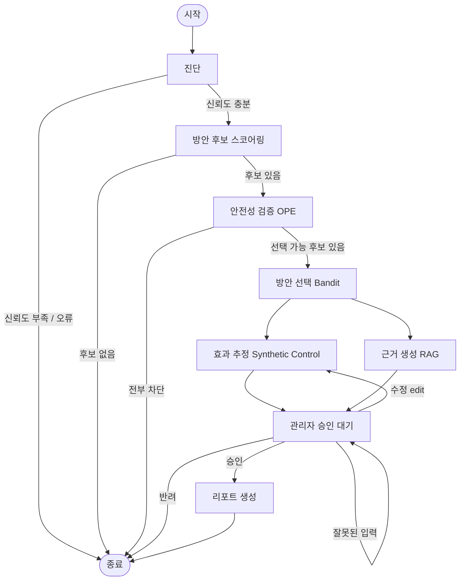
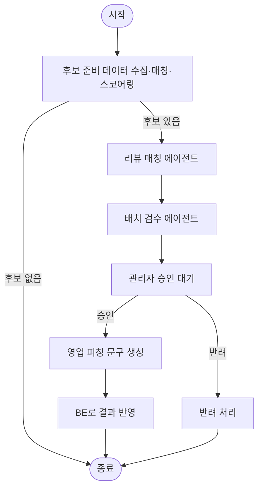
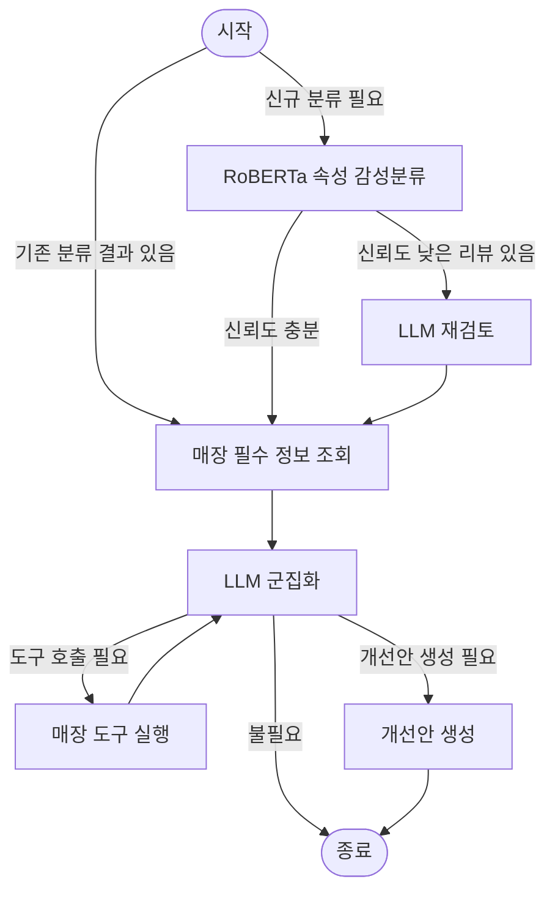

# BP20-AI

매장 분석 및 온오프라인 운영 관리 AI 플랫폼의 **AI 서버**입니다. FastAPI 기반으로, 소상공인의 매출 진단부터 대응방안 추천, 신규 영업 타겟 발굴, 상품 이미지 생성, 영수증 정산, 리뷰 분석까지 — 매장 운영에 필요한 여러 AI 기능을 하나의 서버로 묶어 제공합니다. FE는 이 서버를 직접 호출하지 않고 항상 BE(Spring)를 거쳐 접근합니다.

## 주요 기능

### 1. 전략 추천 (대응방안 추천 에이전트)
매출 데이터를 진단해 문제 유형을 판정하고, 여러 대응방안(쿠폰 발행, 타임세일, 세트메뉴 도입 등) 중 가장 효과적인 방안을 골라 근거 있는 리포트로 제안합니다. 관리자가 승인/수정/반려할 수 있는 워크플로우까지 포함합니다.

- **진단**: Cox 시변 공변량 생존분석(`lifelines`)으로 매출 위험도 산정
- **방안 선택**: Neural Contextual Bandit(PyTorch, UCB 기반) — 상황(context)에 맞는 최적 액션 탐색
- **사전 검증**: Off-Policy Evaluation, Synthetic Control로 실행 전에 효과를 통계적으로 미리 검증
- **근거 생성**: RAG(검색 증강 생성) — 학술/공공통계 문헌에서 근거를 찾아 OpenAI로 리포트 작성
- **오케스트레이션**: LangGraph(진단 → 방안탐색 → 검증 → 승인대기 → 리포트 생성)

**워크플로우**



### 2. 신규 가맹점 영업 타겟 추천(가맹점 추천 에이전트)
공공 상가업소 데이터와 자사 가맹점 DB를 비교해, 아직 자사 서비스를 쓰지 않는 유망 업장을 찾아 영업 우선순위를 매깁니다.

- 서울 열린데이터광장 공공데이터 API로 상권 성장률·유동인구·업종 정보 수집
- Google Places API로 리뷰 활성도 반영
- 성장률·유동인구·리뷰 활성도·우수 가맹점 유사도 4개 지표를 종합한 점수화
- LangGraph 기반 배치 실행 + 관리자 승인/반려 워크플로우

**워크플로우**



### 3. AI 상품 이미지 생성
매장의 상품 사진을 업로드하면 배경을 교체한 프로페셔널한 상품 이미지를 생성합니다.

- `rembg`로 상품 배경 제거
- OpenAI `gpt-image-1`로 카테고리별 배경 합성(카페 테이블, 베이커리 접시 등 프리셋 제공)

### 4. 영수증 OCR 자동 정산
영수증 사진을 인식해 지출 내역을 자동으로 추출·분류합니다.

- PaddleOCR + OpenCV로 영수증 텍스트 인식 및 전처리
- 추출한 항목을 식자재/소모품 등으로 자동 분류해 정산 리포트 생성

### 5. 리뷰 감성 분석 & 개선안 생성
매장 리뷰를 속성 단위로 분석해 어떤 부분이 강점/약점인지 파악하고 개선안을 제안합니다.

- RoBERTa 기반 ABSA(속성 기반 감성분석, 4-class) 모델로 리뷰 1차 분류
- 신뢰도가 낮은 분류는 OpenAI LLM으로 재검토(리파인) 및 군집화
- LangGraph로 "리뷰 분류 → 군집화 → 매장 개선안 생성" 파이프라인 구성

**워크플로우**



### 6. 온라인 트렌드 리포트
업종별로 요즘 인기 있는 메뉴가 무엇인지 온라인 검색 트렌드를 기반으로 리포트를 생성합니다.

- 네이버 데이터랩 검색어트렌드 API로 업종별 후보 메뉴의 검색량 비교
- 검색량 상위 메뉴를 선별해 HTML 리포트로 제공

### 7. 캠페인 학습 로그
전략 추천이 실제로 실행된 뒤의 결과를 학습 데이터로 축적해, Bandit 정책이 점점 더 나은 방안을 추천하도록 개선합니다.

## 기술 스택

| 주요 기능 | 사용 기술 |
|---|---|
| 전략 추천 (대응방안 추천 에이전트) | FastAPI · LangGraph(SQLite/PostgreSQL 체크포인터) · lifelines(Cox 생존분석) · PyTorch(Neural Contextual Bandit) · scikit-learn(OPE) · scipy(Synthetic Control) · sentence-transformers(`BAAI/bge-m3`, RAG 임베딩) · OpenAI |
| 신규 가맹점 영업 타겟 추천 | FastAPI · LangGraph(SQLite/PostgreSQL 체크포인터) · pandas/numpy · pyproj(좌표 변환) · 서울 열린데이터광장 API · Google Places API · OpenAI(추천 사유 생성) |
| AI 상품 이미지 생성 | rembg · Pillow · OpenAI `gpt-image-1` |
| 영수증 OCR 자동 정산 | PaddleOCR · OpenCV · Pillow |
| 리뷰 감성 분석 & 개선안 생성 | HuggingFace Transformers(RoBERTa ABSA) · LangGraph · OpenAI |
| 온라인 트렌드 리포트 | 네이버 데이터랩 검색어트렌드 API · pandas |
| 캠페인 학습 로그 | pandas · Celery/Redis(비동기 집계) |

## 실행 방법

프로젝트 폴더에서 가상환경을 생성하고 패키지를 설치합니다.

```powershell
python -m venv venv
.\venv\Scripts\Activate.ps1
pip install -r requirements.txt
```

`.env.example`을 복사한 뒤 `.env`에 실제 API 키를 입력합니다.

```powershell
Copy-Item .env.example .env
```

에이전트 실행에 필요한 데이터와 모델이 다음 위치에 있어야 합니다.

```text
data/agent/
├─ trend_panel.csv
├─ campaign_logs_v2.csv
└─ neighbor_sales_quarterly.csv

model/
├─ cox_risk.pkl
├─ bandit/
└─ rag_index/export/
```

FastAPI 서버를 실행합니다.

```powershell
python -m uvicorn app.main:app --reload
```

- 서버 주소: `http://127.0.0.1:8000`
- Swagger UI: `http://127.0.0.1:8000/docs`
