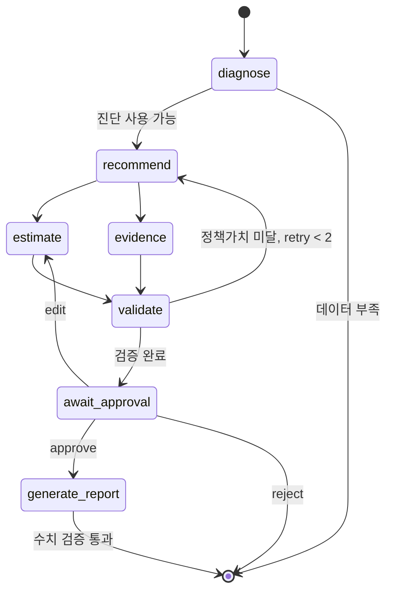

# 고객 대응방안 추천 에이전트

## 목표와 원칙

매출 진단 이후 실행 가능한 대응방안을 선택하고, 예상 효과·문헌 근거·과거 정책가치를 검증한
뒤 담당자의 승인을 받아 최종 리포트를 생성한다. 분석 단위는 상권·업종·분기다.

- 근거가 부족하면 낮은 신뢰도나 `판정불가`를 명시한다.
- 실제 패널과 캠페인 로그를 우선하며 효과 수치를 임의로 만들지 않는다.
- 의사결정 흐름은 재현 가능한 규칙으로 제어하고 LLM은 최종 리포트에 사용한다.
- 사용자가 수정한 방안을 정책 평가 결과로 다시 덮어쓰지 않는다.

## 처리 흐름

| 단계 | 역할 | 구현 |
|---|---|---|
| `diagnose` | 매출 상태·문제유형 판정 | Diagnoser |
| `recommend` | 후보 방안 선택 | Neural Contextual Bandit |
| `estimate` | 무대응 베이스라인·실측 효과 추정 | Synthetic Control |
| `evidence` | 문헌 근거·허용 수치 검색 | RAG |
| `validate` | 과거 로그 기반 정책 평가 | IPS·DM·DR |
| `await_approval` | 승인·수정·거절 대기 | LangGraph interrupt |
| `generate_report` | 근거 기반 리포트·수치 재검증 | OpenAI + 검증기 |

상태는 SQLite 체크포인터에 `thread_id`별로 저장하며 승인 대기 후 별도 요청으로 재개한다.

## 모델 구성

### Neural Contextual Bandit

문제유형별 실행 가능한 후보만 arm으로 제공한다. 작은 MLP 인코더와 선형 head를 사용하며,
실측 로그가 부족하면 prior 기반 콜드스타트로 동작한다. 정책 버전, propensity, 표본 수를 기록한다.

### Synthetic Control

랜덤화 로그가 부족하므로 기존 상권 패널을 활용한다. 같은 업종·상권유형의 유사 셀 중 최대
30개를 donor로 사용한다. 캠페인 사례가 없으면 베이스라인만 반환하고 실측 효과는 판정하지 않는다.

### OPE

IPS·Direct Method·Doubly Robust를 함께 계산한다. 표본 수, 유효표본크기, 신뢰구간이 기준을
통과한 경우에만 정책 비교에 사용한다. self-test 결과는 실제 정책 효과로 보고하지 않는다.

### RAG

BGE-M3 임베딩과 numpy 내적 검색을 사용한다. 검색 근거에 포함된 수치만 최종 문장에 허용하고
생성 결과의 수치를 재검증한다. 상세 계약은 `../rag/HANDOFF.md`를 따른다.

## 문제유형과 후보

- `고객_회복`: 할인·쿠폰·타임세일·세트·사이드·배달
- `차별화`: 리뉴얼·신메뉴·배달
- `관찰`: 웰컴 프로모션·리뷰 관리
- `강점_확대`: 브랜드 SNS·지역 제휴
- `구조_전환`: 프로모션으로 해결하기 어려워 후보를 제시하지 않음

후보가 없거나 진단 신뢰도가 부족하면 추천을 강행하지 않고 사유와 함께 종료한다.

## 승인 흐름

- `approve`: 선택된 방안으로 최종 리포트 생성
- `edit`: 담당자가 고른 후보로 효과·근거를 다시 계산하고 재승인 대기
- `reject`: 리포트를 생성하지 않고 종료

API 계약은 `analysis_recommendation_api.md`를 따른다.

## 현재 결정 사항

- 규칙 기반 Supervisor를 사용한다.
- DeepAR·DQN류 모델과 LLM 자체 파인튜닝은 적용하지 않는다.
- RAG 수치는 외부 사례이며 해당 매장의 실측 효과로 표현하지 않는다.
- OPE가 기준정책보다 낮은 후보를 최대 두 번 재선택한다.
- RAG 임베딩 모델을 사용할 수 없으면 lexical 검색으로 대체한다.

## 향후 확장

고객군별 추천은 미채택 확장안이다. 적용 전 연령대·성별·요일·시간대별 노출, 실행, 비용,
보상 로그가 필요하다. 표본이 부족하면 상권·업종 전체 추천으로 fallback하고 외부 문헌 수치를
고객군별 실측 효과로 대신하지 않는다.

추천 에이전트의 인증, 비동기 실행, 모델 운영 계획은 `development_plan.md`를 따른다.
